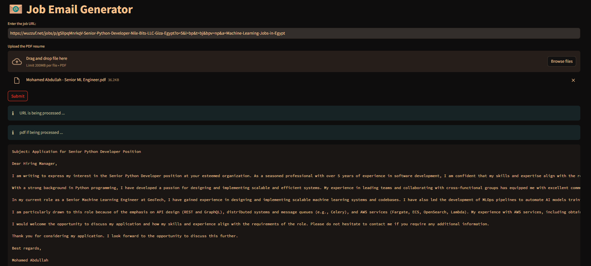

# 📧 Job Email Generator

Job Email Generator is a simple tool that leverages Large Language Models (LLMs) to automatically generate professional job application emails. By analyzing a provided job posting URL and the applicant's resume, this repository intelligently matches relevant skills and experience between the two to craft a tailored job application email.



### How To Run

1. To get started we first need to get an `API_KEY` from here: https://console.groq.com/keys. Inside `app/.env` update the value of `GROQ_API_KEY` with the `API_KEY` you created.

2. To get started, first install the dependencies using:
```shell
pip install -r requirements.txt
```

3. Run the streamlit app:

```shell
streamlit run src/main.py
```

